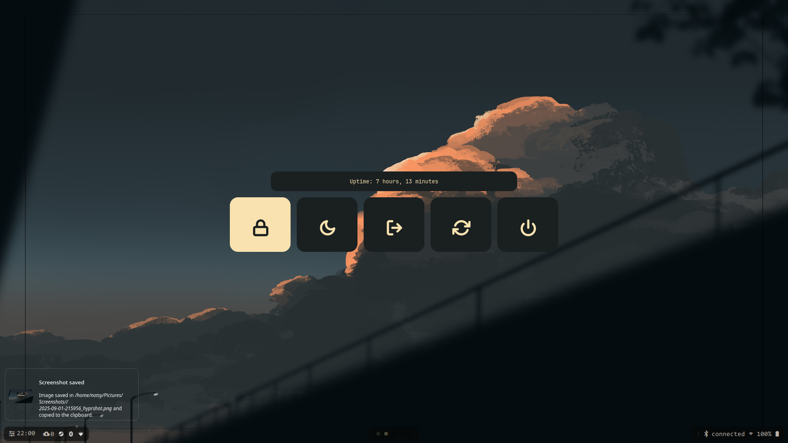

# Arch Linux Dotfiles & Setup

**Minimal, productivity-oriented, and fully functional setup**  
This repository contains my personal dotfiles and a bootstrap script for quickly setting up a working Arch Linux environment.  
It’s designed for me (by the help of some other's people dots, ill add the references later), but can also be used as a starter template for anyone who wants a fast, minimal and productive workflow.

---

## Installation

Clone this repo as a **bare git repo** and checkout your dotfiles:

```bash
git clone --bare <git-repo-url> $HOME/.dotfiles
alias dotfiles='/usr/bin/git --git-dir=$HOME/.dotfiles/ --work-tree=$HOME'
dotfiles checkout
dotfiles config --local status.showUntrackedFiles no
```

Then run the installer:

```bash
./install.sh
```

### What the installer does
- Installs all packages listed under [`install/pacman`](install/pacman) and [`install/aur`](install/aur).  
- Bootstraps an AUR helper (`yay`) if it’s not already installed.  
- Sets up and enables system services:
  - `NetworkManager`
  - `pipewire`, `pipewire-pulse`, `wireplumber`
  - `bluetooth`
  - `mariadb` (with automatic database initialization if needed)

---

## Neovim

My Neovim configuration lives in a separate repo:  
https://github.com/isGavri/nvim

---

## Keybindings

Default modifier: **`$mainMod = SUPER`**

| Keys | Action |
|------|--------|
| `Alt + Return` | Launch terminal (`$terminal`) |
| `Alt + Shift + Return` | Launch floating terminal (`[float; move 20% 5%; size 60% 60%] $terminal`) |
| `Alt + Q` | Kill active window |
| `Alt + A` | Application launcher (`$menu`) |
| `Alt + C` | Theme changer |
| `Alt + Z` | Power menu (`$powermenu`) |
| `Alt + S` | Toggle split |
| `Alt + F` | Toggle floating |
| `Alt + Ctrl + F` | Center window |
| `Alt + Tab` | Cycle tiled/floating windows (hyprctl logic) |
| `Alt + H` | Move focus left |
| `Alt + L` | Move focus right |
| `Alt + K` | Move focus up |
| `Alt + J` | Move focus down |
| `Alt + Shift + H` | Move window left |
| `Alt + Shift + J` | Move window down |
| `Alt + Shift + K` | Move window up |
| `Alt + Shift + L` | Move window right |
| `Alt + Ctrl + J` | Resize active -10 -10 |
| `Alt + Ctrl + K` | Resize active +10 +10 |
| `Super + F` | Fullscreen |
| `Super + E` | Open file manager (`$fileManager`) |
| `Super + M` | Exit Hyprland (`uwsm stop`) |
| `Super + J` | Start panel (`$startpanel`) |
| `Super + K` | Kill panel (`$killpanel`) |
| `Super + L` | Lock screen (`$hyprlock`) |
| `Alt + 1..5` | Switch workspace 1–5 |
| `Super + 1..5` | Move window to workspace 1–5 |
| `Ctrl + Alt + L` | Workspace +1 |
| `Ctrl + Alt + H` | Workspace -1 |
| `Super + Shift + L` | Move window to next workspace |
| `Super + Shift + H` | Move window to previous workspace |
| `Ctrl + Shift + L` | Move window to next workspace (silent) |
| `Ctrl + Shift + H` | Move window to previous workspace (silent) |
| `Super + Mouse Scroll` | Workspace scroll (e+1 / e-1) |
| `Super + Mouse Left` | Move window (mouse:272) |
| `Super + Mouse Right` | Resize window (mouse:273) |
| `XF86AudioRaiseVolume` | wpctl set-volume @DEFAULT_AUDIO_SINK@ 5%+ |
| `XF86AudioLowerVolume` | wpctl set-volume @DEFAULT_AUDIO_SINK@ 5%- |
| `XF86AudioMute` | wpctl set-mute @DEFAULT_AUDIO_SINK@ toggle |
| `XF86AudioMicMute` | wpctl set-mute @DEFAULT_AUDIO_SOURCE@ toggle |
| `XF86MonBrightnessUp` | brightnessctl s 10%+ |
| `XF86MonBrightnessDown` | brightnessctl s 10%- |
| `XF86AudioNext` | playerctl next |
| `XF86AudioPause` | playerctl play-pause |
| `XF86AudioPlay` | playerctl play-pause |
| `XF86AudioPrev` | playerctl previous |
| `Alt + Shift + P` | Hyprpicker (`hyprpicker -a`) |
| `Alt + Shift + S` | Hyprshot region to `$HOME/Pictures/Screenshots/` (`hyprshot -m region -o $HOME/Pictures/Screenshots/ -z -- swayimg`) |

> These keybindings are the friendly table representation of the bindings in the config:
>
> ```
> $mainMod = SUPER
> # bind = alt, C, exec, $themes
> bind = alt shift, return, exec, [float; move 20% 5%; size 60% 60%] $terminal
> bind = alt, return, exec, $terminal
> bind = alt, Q, killactive,
> bind = alt, a, exec, $menu
> bind = $mainMod, M, exec, uwsm stop
> bind = $mainMod, F, fullscreen
> bind = $mainMod, E, exec, $fileManager
> bind = alt, F, togglefloating,
> bind = alt+ctrl, F, centerwindow,
> bind = alt, Z, exec, $powermenu
> bind = alt, S, togglesplit, 
> bind = alt, h, movefocus, l
> bind = alt, l, movefocus, r
> bind = alt, k, movefocus, u
> bind = alt, j, movefocus, d
> bind = alt, tab, exec, $(hyprctl activewindow -j | jq '.floating') && hyprctl dispatch cyclenext tiled || hyprctl dispatch cyclenext floating
> bind = alt+shift, h, movewindow, l
> bind = alt+shift, j, movewindow, d
> bind = alt+shift, k, movewindow, u
> bind = alt+shift, l, movewindow, r
> bind = alt+ctrl, j, resizeactive, -10 -10
> bind = alt+ctrl, k, resizeactive, 10 10
> bindl = $mainMod, L, exec, $hyprlock
> bind = $mainMod, K, exec, $killpanel
> bind = $mainMod, J, exec, $startpanel
> bind = alt, 1, workspace, 1
> bind = alt, 2, workspace, 2
> bind = alt, 3, workspace, 3
> bind = alt, 4, workspace, 4
> bind = alt, 5, workspace, 5
> bind = $mainMod, 1, movetoworkspace, 1
> bind = $mainMod, 2, movetoworkspace, 2
> bind = $mainMod, 3, movetoworkspace, 3
> bind = $mainMod, 4, movetoworkspace, 4
> bind = $mainMod, 5, movetoworkspace, 5
> bind = ctrl+alt, l, workspace, +1
> bind = ctrl+alt, h, workspace, -1
> bind = $mainMod+shift, l, movetoworkspace, +1
> bind = $mainMod+shift, h, movetoworkspace, -1
> bind = ctrl+shift,l, movetoworkspacesilent, +1
> bind = ctrl+shift, h, movetoworkspacesilent, -1
> bind = $mainMod, mouse_down, workspace, e+1
> bind = $mainMod, mouse_up, workspace, e-1
> bindm = $mainMod, mouse:272, movewindow
> bindm = $mainMod, mouse:273, resizewindow
> bindel = ,XF86AudioRaiseVolume, exec, wpctl set-volume @DEFAULT_AUDIO_SINK@ 5%+
> bindel = ,XF86AudioLowerVolume, exec, wpctl set-volume @DEFAULT_AUDIO_SINK@ 5%-
> bindel = ,XF86AudioMute, exec, wpctl set-mute @DEFAULT_AUDIO_SINK@ toggle
> bindel = ,XF86AudioMicMute, exec, wpctl set-mute @DEFAULT_AUDIO_SOURCE@ toggle
> bindel = ,XF86MonBrightnessUp, exec, brightnessctl s 10%+
> bindel = ,XF86MonBrightnessDown, exec, brightnessctl s 10%-
> bindl = , XF86AudioNext, exec, playerctl next
> bindl = , XF86AudioPause, exec, playerctl play-pause
> bindl = , XF86AudioPlay, exec, playerctl play-pause
> bindl = , XF86AudioPrev, exec, playerctl previous
> ## Hyprpicker and hyprshot
> bind = alt shift, p, exec, hyprpicker -a
> bind = alt shift, s, exec, hyprshot  -m region -o $HOME/Pictures/Screenshots/ -z -- swayimg
> ```

---

## Screenshots

A glimpse into the setup (images are in `assets/`):

- **Terminal nvim cava and btop**  
  

- **Floating terminal**  
  

- **Powermenu**  
  

- **Menu**  
  

- **SwayNC Pane**  
  

- **SwayNC Notification**  
  

- **Zathura PDF Reader**  
  

- **Fastfetch and Neovim**  
  

---

## Features

- Minimal, distraction-free and productivity-oriented workflow  
- Easy bootstrap with `install.sh`  
- Package lists separated for pacman and AUR (see `install/pacman` and `install/aur`)  
- Preconfigured services for daily use (network, audio, DB, bluetooth)  
- Neovim-centered workflow with its own dedicated config

---

## Roadmap / TODO

- [ ] Add more documentation for each package in `install/pacman` and `install/aur`  
- [ ] Expand configuration details  
- [ ] Write a post-install guide (fonts, theming, etc.)  
- [ ] Add optional modules (gaming, dev-tools, etc.)  

---

## License

MIT License — use, modify, and share freely.
```
